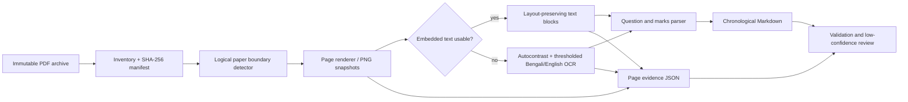

# PDF parsing architecture

The pipeline is evidence-first: source PDFs remain untouched, each rendered page has a stable source reference, and Markdown is a derived view rather than the only copy of extracted text.

## Output contract

Each source PDF produces `document.md`, `evidence.json`, page-level raw text, and optional PNG snapshots under `.pipeline-output/documents/<source path>/`. The top-level `manifest.json` is ordered by examination year, subject, and source path; multi-year compilations are labeled `2017–2025`; `chronology.md` is the human-readable index; `review.md` lists low-confidence pages and unresolved metadata.

`evidence.json` records the source checksum, extraction mode, OCR confidence, raw-text path, snapshot path, and logical paper unit. This makes a correction traceable back to the exact source page.

## Processing modes

Use `--max-pdfs 1` for a pilot. The normal command discovers all PDFs. Use `--no-snapshots` only when storage is constrained; snapshots are recommended for review because OCR quality cannot be judged from Markdown alone.

